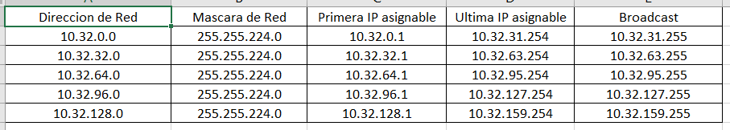
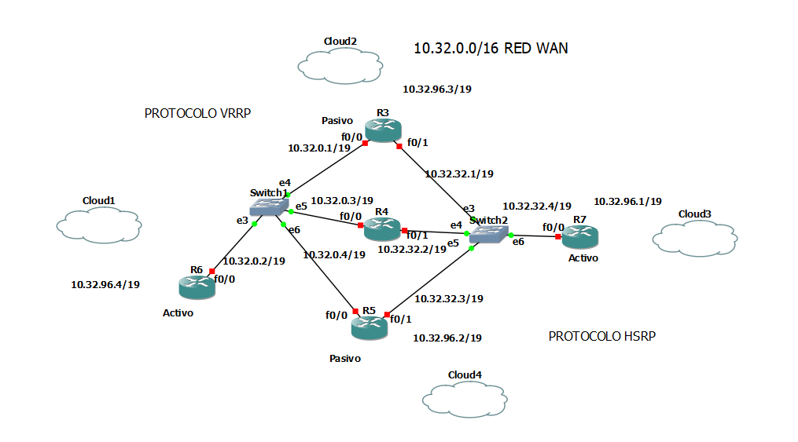
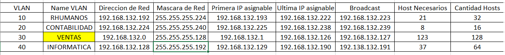
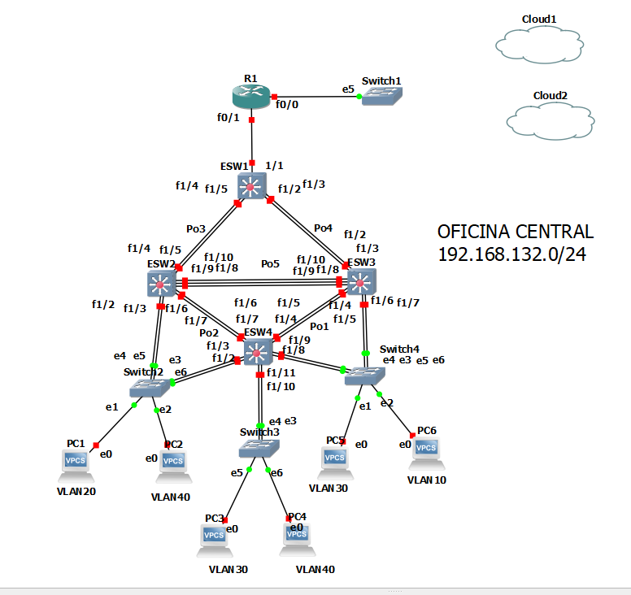
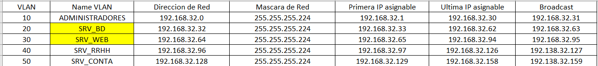
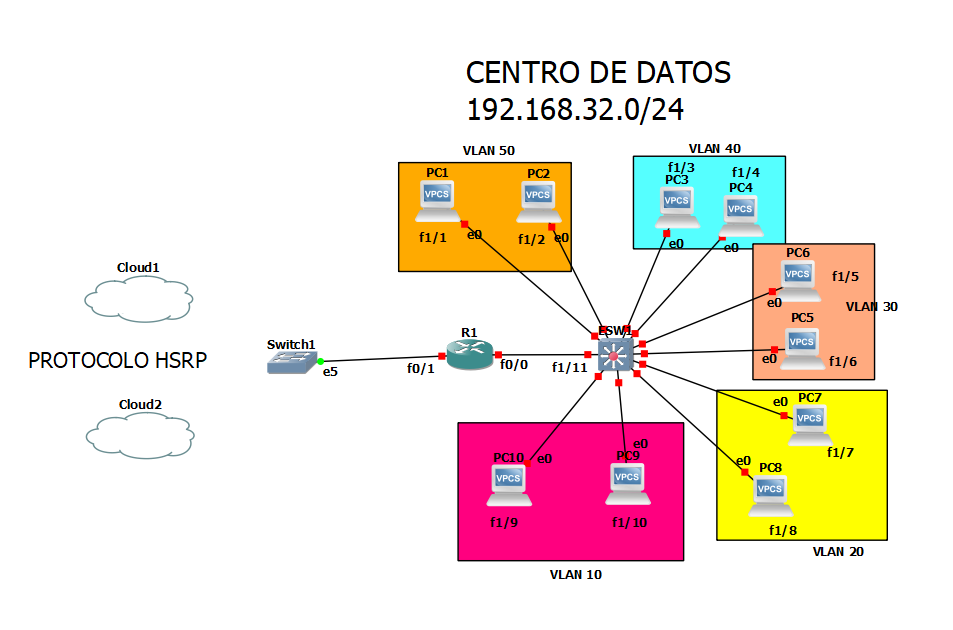

# REDES1-Proyecto-G32
## Table of contents
- [REDES1-Proyecto-G32](#redes1-proyecto-g32)
  - [Table of contents](#table-of-contents)
  - [Integrantes](#integrantes)
  - [Topologia 1](#topologia-1)
    - [Tabla de Subneteo](#tabla-de-subneteo)
    - [Vista Topologia](#vista-topologia)
    - [Configuraciones Topologia](#configuraciones-topologia)
  - [Topologia 2](#topologia-2)
    - [Tabla de Subneteo](#tabla-de-subneteo-1)
    - [Vista Topologia](#vista-topologia-1)
    - [Comandos](#comandos)
  - [Topologia 3](#topologia-3)
    - [Tabla Subneteo](#tabla-subneteo)
    - [Vista Topologia](#vista-topologia-2)
    - [Comandos](#comandos-1)

## Integrantes

| Nombres  | Carnet |
| ------------- |:-------------:|
| Yovany Enrique Samines Orozco	      | 201403689  |
| Esdras Jonatan Noj Larios	      | 201513699     |
| Juan Daniel Enrique Roman Barrientos	      | 201801364    |
| José Luis Herrera Martínez	|  201807431 |

## Topologia 1
### Tabla de Subneteo 

### Vista Topologia

 

### Configuraciones Topologia 

    ---------R6--------------------
    conf terminal
    int f0/0
    ip address 10.32.0.2 255.255.224.0
    no shutdown
    exit
    int f0/1
    ip address 10.32.96.4 255.255.224.0
    no shutdown
    exit
    router rip 
    version 2
    network 10.32.0.0
    network 10.32.96.0
    exit
    int f0/0
    vrrp 1 ip 10.32.31.254
    vrrp 1 priority 200
    vrrp 1 preempt
    exit 
    do write
    exit
    -------R3----------------------
    conf term 
    int f0/0 
    ip address 10.32.0.1 255.255.224.0
    no shutdown
    exit
    int f0/1
    ip address 10.32.32.1 255.255.224.0
    no shutdown
    exit
    int f1/0
    ip address 10.32.96.3 255.255.224.0
    no shutdown
    exit
    router rip 
    version 2
    network 10.32.0.0
    network 10.32.96.0
    network 10.32.32.0
    exit
    int f0/0
    vrrp 1 ip 10.32.31.254
    vrrp 1 priority 200
    exit
    do write
    exit
    --------R4----------------------
    conf term
    int f0/0
    ip address 10.32.0.3 255.255.224.0
    no shutdown
    exit
    int f0/1
    ip address 10.32.32.2 255.255.224.0
    no shutdown
    exit
    router rip 
    version 2
    network 10.32.0.0
    network 10.32.32.0
    exit
    do write
    exit
    --------R5----------------------
    conf term
    int f0/0 
    ip address 10.32.0.4 255.255.224.0
    no shutdown
    exit
    int f0/1
    ip address 10.32.32.3 255.255.224.0
    no shutdown
    exit
    int f1/0
    ip address 10.32.96.2 255.255.224.0
    no shutdown
    exit
    router rip
    version 2
    network 10.32.0.0
    network 10.32.32.0
    network 10.32.96.0
    exit
    do write
    exit
    --------R7----------------------
    conf term 
    int f0/0 
    ip address 10.32.32.4 255.255.224.0
    no shutdown
    exit
    int f0/1
    ip address 10.32.96.1 255.255.224.0
    no shutdown
    exit
    router rip
    version 2
    network 10.32.32.0
    network 10.32.96.0
    exit

## Topologia 2
### Tabla de Subneteo 

### Vista Topologia 

### Comandos 
    -------SW1-----------
    conf term
    vtp domain redes1gp32
    vtp password redes1gp32
    vtp mode client
    end
    wr
    -------SW2------------

    conf term
    vtp domain redes1gp32
    vtp password redes1gp32
    vtp mode client
    end
    wr

    -------SW3-------------
    conf term
    vtp domain redes1gp32
    vtp password redes1gp32
    vtp mode client
    end
    wr

    -------SW4-------------
    conf term
    vtp domain redes1gp32
    vtp password redes1gp32
    vtp mode server
    end
    wr

    -------VLANS ----------
    conf term
    vlan 10
    name RHUMANOS
    exit
    vlan 20
    name CONTABILIDAD
    exit
    vlan 30
    name VENTAS
    exit
    vlan 40
    name INFORMATICA
    end
    wr
    ----- PortChannel SW1 -----
    conf t
    int range f1/4 - 5
    channel-group 3 mode on
    end
    conf t
    int range f1/2 - 3
    channel-group 4 mode on
    end
    wr

    ----- PortChannel SW2 -----
    conf t
    int range f1/4 - 5
    channel-group 3 mode on
    end
    conf t
    int range f1/6 - 7
    channel-group 2 mode on
    end
    conf t
    int range f1/8 - 10
    channel-group 5 mode on
    end
    wr

    ----- PortChannel SW3 -----
    conf t
    int range f1/2 - 3
    channel-group 4 mode on
    end
    conf t
    int range f1/4 - 5
    channel-group 1 mode on
    end
    conf t
    int range f1/8 - 10
    channel-group 5 mode on
    end
    wr

    ----- PortChannel SW4 -----
    conf t
    int range f1/6 - 7
    channel-group 2 mode on
    end
    conf t
    int range f1/4 - 5
    channel-group 1 mode on
    end
    wr
    ----- Truncales SW1 ----
    conf term 
    int f1/1
    switchport mode trunk
    switchport trunk allowed vlan 1,10,20,30,40,1002-1005
    end
    conf term 
    int po3
    switchport mode trunk
    switchport trunk allowed vlan 1,10,20,30,40,1002-1005
    end
    conf term 
    int po4
    switchport mode trunk
    switchport trunk allowed vlan 1,10,20,30,40,1002-1005
    end
    wr
    ----- Truncales SW2 ----
    conf term
    int po3
    switchport mode trunk
    switchport trunk allowed vlan 1,10,20,30,40,1002-1005
    end
    conf term
    int po5
    switchport mode trunk
    switchport trunk allowed vlan 1,10,20,30,40,1002-1005
    end
    conf term
    int po2
    switchport mode trunk
    switchport trunk allowed vlan 1,10,20,30,40,1002-1005
    exit
    int f1/3
    switchport mode trunk
    switchport trunk allowed vlan 1,10,20,30,40,1002-1005
    exit
    int f1/2
    switchport mode trunk
    switchport trunk allowed vlan 1,10,20,30,40,1002-1005
    end
    wr
    ----- Truncales SW3 ----
    conf term
    int po4
    switchport mode trunk
    switchport trunk allowed vlan 1,10,20,30,40,1002-1005
    end
    conf term
    int po5
    switchport mode trunk
    switchport trunk allowed vlan 1,10,20,30,40,1002-1005
    end
    conf term
    int po1
    switchport mode trunk
    switchport trunk allowed vlan 1,10,20,30,40,1002-1005
    exit
    int f1/7
    switchport mode trunk
    switchport trunk allowed vlan 1,10,20,30,40,1002-1005
    exit
    int f1/6
    switchport mode trunk
    switchport trunk allowed vlan 1,10,20,30,40,1002-1005
    end
    wr
    ----- Truncales SW4 ----
    conf term
    int po2
    switchport mode trunk
    switchport trunk allowed vlan 1,10,20,30,40,1002-1005
    end
    conf term
    int po1
    switchport mode trunk
    switchport trunk allowed vlan 1,10,20,30,40,1002-1005
    exit
    int f1/3
    switchport mode trunk
    switchport trunk allowed vlan 1,10,20,30,40,1002-1005
    exit
    int f1/2
    switchport mode trunk
    switchport trunk allowed vlan 1,10,20,30,40,1002-1005
    exit
    int f1/10
    switchport mode trunk
    switchport trunk allowed vlan 1,10,20,30,40,1002-1005
    exit
    int f1/11
    switchport mode trunk
    switchport trunk allowed vlan 1,10,20,30,40,1002-1005
    exit
    int f1/8
    switchport mode trunk
    switchport trunk allowed vlan 1,10,20,30,40,1002-1005
    exit
    int f1/9
    switchport mode trunk
    switchport trunk allowed vlan 1,10,20,30,40,1002-1005
    end
    wr
    ----SPANNING TREE SW4--------
    spanning-tree vlan 1 root primary
    spanning-tree vlan 10 root primary
    spanning-tree vlan 20 root primary
    spanning-tree vlan 30 root primary
    spanning-tree vlan 40 root primary
    ----DHCP AND VLANROUTING R1---------
    conf term
    int f0/1
    no shutdown
    exit
    int f0/0
    no shutdown
    exit
    int f0/1.30
    encapsulation dot1Q 30
    ip address 192.168.132.1 255.255.255.128
    no shutdown
    exit
    int f0/1.40
    encapsulation dot1Q 40
    ip address 192.168.132.129 255.255.255.192
    no shutdown
    exit
    int f0/1.10
    encapsulation dot1Q 10
    ip address 192.168.132.193 255.255.255.224
    no shutdown
    exit
    int f0/1.20
    encapsulation dot1Q 20
    ip address 192.168.132.225 255.255.255.240
    no shutdown
    exit
    int f0/1.30
    ip dhcp pool ventas
    network 192.168.132.0 255.255.255.128
    default-router 192.168.132.1
    exit
    int f0/1.40
    ip dhcp pool informatica
    network 192.168.132.128 255.255.255.192
    default-router 192.168.132.129
    exit
    int f0/1.10
    ip dhcp pool rrhh
    network 192.168.132.192 255.255.255.224
    default-router 192.168.132.193
    exit
    int f0/1.20
    ip dhcp pool conta
    network 192.168.132.224 255.255.255.240
    default-router 192.168.132.225
    exit
## Topologia 3
### Tabla Subneteo 

### Vista Topologia 

### Comandos
